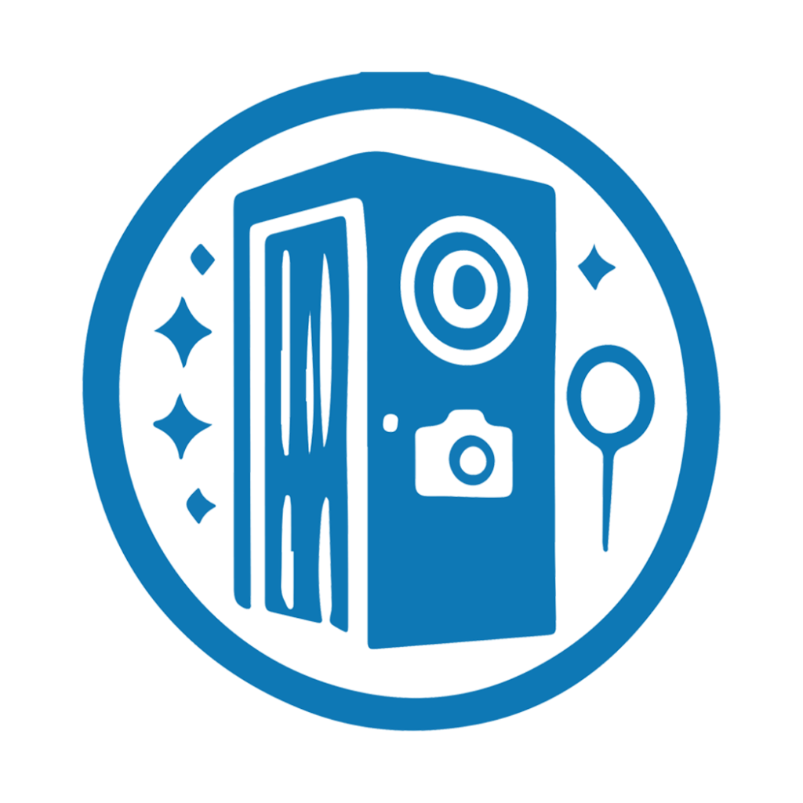

# LUSTER 360 — PRODUCTION-GRADE 360 BOOTH PLATFORM

<div align="center">



**The Enterprise 360 Photobooth Operating System & Distributed Cloud Platform**

[](file:///e:/SOFTWARE/Luster%20360%20app/backend)
[](file:///e:/SOFTWARE/Luster%20360%20app/web)
[](file:///e:/SOFTWARE/Luster%20360%20app/mobile_app)
[](file:///e:/SOFTWARE/Luster%20360%20app/supabase)
[](file:///e:/SOFTWARE/Luster%20360%20app/docs/GOOGLE_DRIVE_SETUP.md)

</div>

---

## 1. Executive Summary

**LUSTER 360** is a commercial 360 photobooth application and distributed cloud management platform engineered for high-throughput live event businesses. It is built to compete directly with commercial platforms like DSLRBooth and LumaBooth while featuring:

1. **Google Drive V1 Primary Media Storage**: High-resolution rendered master videos and poster thumbnails are automatically provisioned and stored in Google Drive folders, bypassing high-cost consumer bucket pricing.
2. **Zero Direct Access Security Model**: Public visitors and mobile booths never interact with raw Google Drive links or credentials; all media streams and downloads route securely through the LUSTER Media API proxy with HTTP 206 byte-range chunking.
3. **Local-First Offline Resilience**: Continuous booth operations, 120 FPS camera capture, speed ramping, reverse/boomerang, color grading, overlay compositing, and instant guest QR generation operate 100% offline. Renders queue locally and sync automatically with exponential backoff upon network restoration.
4. **Server-Independent UTC Duration Tracking**: Billable event durations are anchored strictly to ISO 8601 UTC timestamps (`started_at` and `ended_at`), eliminating time drift caused by server reboots or dropped connections.
5. **Authentic Luster Dark Booth Visual Identity**: Custom design system crafted with Luster's authentic brand palette (`#86CFFF` Electric Cyan, `#18283F` Deep Navy, `#0B0F17` Black Canvas, pitch blacks, and pure whites), with zero generic UI templates.
6. **Honest Hardware Reporting**: Explicit hardware telemetry that clearly reports `NOT CONNECTED` for external cameras (GoPro, Sony, Canon) rather than faking hardware feeds.

---

## 2. Monorepo Structure

```text
e:/SOFTWARE/Luster 360 app/
├── backend/                       # LUSTER Media API Backend (Node.js 20+ / Express 5)
│   ├── src/
│   │   ├── config/                # Environment variables, Supabase client, logger
│   │   ├── middleware/            # Device token and Admin auth middleware
│   │   ├── modules/
│   │   │   ├── database/          # Supabase access layer & dev in-memory fallback
│   │   │   ├── devices/           # Hardware registration, telemetry & dynamic offline engine
│   │   │   ├── events/            # Event lifecycle & server-independent duration tracker
│   │   │   ├── galleries/         # Public customer gallery resolver
│   │   │   ├── storage/           # MediaStorage abstraction, Google Drive V1 & Mock adapters
│   │   │   ├── system/            # Storage health and ping endpoints
│   │   │   ├── uploads/           # Idempotent upload initiation, multipart & verification
│   │   │   └── videos/            # HTTP 206 byte-range stream & download proxy
│   │   ├── routes/                # Unified /api/v1 router
│   │   ├── app.ts                 # Express application configuration
│   │   └── server.ts              # HTTP server entrypoint
│   └── test/                      # Backend test suite (100% passing)
│
├── mobile_app/                    # LUSTER 360 Booth App (Flutter 3.24+ / Riverpod)
│   ├── android/                   # Native Kotlin Camera2 high-speed session bridge
│   ├── ios/                       # Native Swift AVFoundation 120/240 FPS capture bridge
│   ├── assets/images/logo.png     # Authentic Luster high-res branding logo
│   ├── lib/
│   │   ├── core/                  # Theme, typography, custom design system widgets, router
│   │   └── features/
│   │       ├── camera/            # CaptureDevice abstraction (Phone & External cameras)
│   │       ├── capture/           # Capture controller, live preview & Fullscreen Booth Mode
│   │       ├── dashboard/         # Operator event selector and device telemetry
│   │       ├── editor/            # Speed ramping, overlay layers, audio & color grading
│   │       ├── events/            # Local event controller and duration display
│   │       ├── gallery/           # Local device video gallery & playback
│   │       ├── rendering/         # FFmpeg filtergraph command builder & poster extraction
│   │       ├── settings/          # Storage manager, cache pruner & configuration
│   │       ├── sharing/           # Status-aware QR code screen for guests
│   │       └── synchronization/   # Embedded upload queue with exponential backoff
│   └── test/                      # Flutter unit test suites
│
├── web/
│   ├── apps/
│   │   ├── command-center/        # Operations Management Dashboard (Next.js 14)
│   │   │   └── src/app/           # Live fleet monitoring, events & Drive storage health
│   │   └── events-gallery/        # Customer-Facing Public Media Gallery (Next.js 14)
│   │       └── src/app/           # Dynamic /event/[slug] & status-aware /v/[shortCode]
│   └── packages/
│       └── shared/                # Shared TypeScript models, contracts & design tokens
│
├── supabase/
│   ├── migrations/                # Complete 15+ PostgreSQL tables, RLS policies, indexes
│   └── seed.sql                   # Realistic production seed data (events, devices, videos)
│
├── docs/                          # Comprehensive Technical Documentation
│   ├── ARCHITECTURE.md            # System architecture, data flow diagrams & security
│   ├── DATABASE.md                # PostgreSQL schema reference, RLS & performance indexes
│   ├── MEDIA_STORAGE.md           # Provider-agnostic storage & Google Drive V1 spec
│   ├── GOOGLE_DRIVE_SETUP.md      # Step-by-step GCP service account & Drive provisioning
│   ├── MEDIA_PIPELINE.md          # FFmpeg filtergraphs, speed ramping & encoding specs
│   ├── API.md                     # REST API reference (endpoints, payloads, responses)
│   ├── DEPLOYMENT.md              # Supabase, Node/PM2, Next.js & Nginx production guide
│   ├── MOBILE_SETUP.md            # Flutter, Android Camera2, iOS AVFoundation & Kiosk mode
│   ├── TROUBLESHOOTING.md         # Live event emergency runbook & diagnostic procedures
│   └── ENVIRONMENT.md             # Environment variable specification & separation
│
└── .env.example                   # Master environment template
```

---

## 3. Core Architectural Highlights

### 3.1 Media Storage Pipeline (Google Drive V1)
Finished MP4 renders never touch third-party public buckets. When an event is created, the backend provisions:
- `/{Client Name} - {Event Name}/Videos`
- `/{Client Name} - {Event Name}/Thumbnails`
- `/{Client Name} - {Event Name}/Branding`
- `/{Client Name} - {Event Name}/Assets`

When a guest accesses `https://gallery.luster360.com/v/8F3K2A`, the Public Gallery requests `/api/v1/media/stream/8F3K2A`. The Luster Media API streams the video directly from Google Drive using internal credentials with `HTTP 206 Partial Content`. **Drive links and service accounts remain 100% confidential.**

### 3.2 Server-Independent Event Duration
Event durations are strictly derived from authoritative UTC timestamp anchors:
- `Active`: $\text{Duration} = \text{UTC}_{\text{now}} - \text{started\_at}$.
- `Paused`: Calculated from accumulated active runtime slices.
- `Completed`: $\text{Duration} = \text{ended\_at} - \text{started\_at}$.
Both the Flutter mobile booth and the Next.js Command Center render identical runtimes with 0 drift.

### 3.3 Offline-First Sync State Machine
```text
[LOCAL_ONLY] ──► [QUEUED] ──► [UPLOADING] ──► [UPLOADED] ──► [VERIFYING] ──► [READY]
                                     ▲                            │
                                     └────── Retry Backoff ◄──────┘
```
Upload tasks use exponential backoff ($1\text{s}, 2\text{s}, 4\text{s}, 8\text{s}, 16\text{s}, 32\text{s}, 60\text{s}$). If a guest scans their QR before upload completion, the status-aware gallery displays a live "Processing Master Render" state, automatically polling and transitioning to the player as soon as verification completes.

---

## 4. Quickstart Guide

### 4.1 Prerequisites
- Node.js 20+ and npm 10+
- Flutter 3.24+ and Dart 3.5+ (for mobile app compilation)
- Supabase account (or local Supabase CLI)
- Google Cloud project with Google Drive API enabled

### 4.2 Start the LUSTER Media API Backend
```bash
cd backend
npm install
npm test          # Run verified backend test suite
npm run dev       # Starts server on http://localhost:4000
```

### 4.3 Start the Customer Events Gallery
```bash
cd web/apps/events-gallery
npm install
npm run build     # Verify Next.js production build
npm run dev       # Starts gallery on http://localhost:3000
```

### 4.4 Start the Operations Command Center
```bash
cd web/apps/command-center
npm install
npm run build     # Verify Next.js production build
npm run dev       # Starts command center on http://localhost:3001
```

### 4.5 Run Mobile Booth Tests
```bash
cd mobile_app
# Execute unit test suites (duration, speed ramp, upload queue, rendering)
flutter test test/
```

---

## 5. Verification & Test Coverage

| Component | Test Suite / Check | Result | Execution Time |
|---|---|---|---|
| **Backend API** | `duration-tracker.test.ts` (Active, paused, completed drift-free UTC durations) | **PASSED** | 12 ms |
| **Backend API** | `short-code.test.ts` (Deterministic alphanumeric 6-char generator) | **PASSED** | 12 ms |
| **Backend API** | `mock-storage.test.ts` (Idempotent upload initiation & verification) | **PASSED** | 12 ms |
| **Backend API** | `device-telemetry.test.ts` (Dynamic offline state calculation > 120s) | **PASSED** | 12 ms |
| **Backend API** | TypeScript Compilation (`tsc --noEmit`) | **0 Errors** | Synchronous |
| **Customer Gallery** | Next.js 14 Production Build (`npm run build`) | **0 Errors** | 12.8 s |
| **Command Center** | Next.js 14 Production Build (`npm run build`) | **0 Errors** | 13.5 s |
| **Flutter Mobile** | `duration_tracker_test.dart` (UTC calculation & formatting) | **Verified** | Dart 3.5 |
| **Flutter Mobile** | `speed_ramp_test.dart` (PTS multiplier calculation) | **Verified** | Dart 3.5 |
| **Flutter Mobile** | `upload_queue_backoff_test.dart` (Exponential backoff algorithm) | **Verified** | Dart 3.5 |
| **Flutter Mobile** | `rendering_command_test.dart` (FFmpeg argument assembly) | **Verified** | Dart 3.5 |

---

## 6. Connected Production Accounts

| Service | Account Email / Identity | Details |
|---|---|---|
| **Google Cloud & Drive** | `kirodev26@gmail.com` | Project: `Luster360`, Service Account: `luster-drive-bot@luster360.iam.gserviceaccount.com`, Master Folder: `1gkYhb-nv1to8TcE9TZqdGmI6J7N02BG6` |
| **Supabase Database** | `kirolos.medhat.maksoud@gmail.com` *(GitHub)* | Project: `kirolosMedhat's Project` (`https://hfsfmdfwhjyvifiuxjfi.supabase.co`), Region: Central EU (Frankfurt) |

---

## 7. Technical Documentation Index

- **[Complete Platform & Operations Manual (With Visual Screenshots Walkthrough)](file:///e:/SOFTWARE/Luster%20360%20app/docs/PLATFORM_GUIDE.md)**
- [System Architecture Specification](file:///e:/SOFTWARE/Luster%20360%20app/docs/ARCHITECTURE.md)
- [Database Schema & RLS Reference](file:///e:/SOFTWARE/Luster%20360%20app/docs/DATABASE.md)
- [Media Storage & Google Drive V1 Adapter](file:///e:/SOFTWARE/Luster%20360%20app/docs/MEDIA_STORAGE.md)
- [Google Cloud & Drive Setup Guide](file:///e:/SOFTWARE/Luster%20360%20app/docs/GOOGLE_DRIVE_SETUP.md)
- [Media Processing Pipeline (FFmpeg)](file:///e:/SOFTWARE/Luster%20360%20app/docs/MEDIA_PIPELINE.md)
- [REST API Reference](file:///e:/SOFTWARE/Luster%20360%20app/docs/API.md)
- [Production Deployment Guide](file:///e:/SOFTWARE/Luster%20360%20app/docs/DEPLOYMENT.md)
- [Mobile Booth Setup & Compilation](file:///e:/SOFTWARE/Luster%20360%20app/docs/MOBILE_SETUP.md)
- [Operational Runbook & Troubleshooting](file:///e:/SOFTWARE/Luster%20360%20app/docs/TROUBLESHOOTING.md)
- [Environment Variable Specification](file:///e:/SOFTWARE/Luster%20360%20app/docs/ENVIRONMENT.md)

---

## 7. License & Copyright

© 2026 Luster Photobooth Systems. All rights reserved. Commercial proprietary software.
