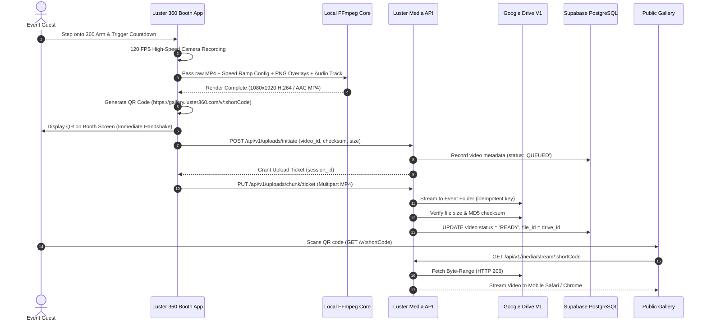
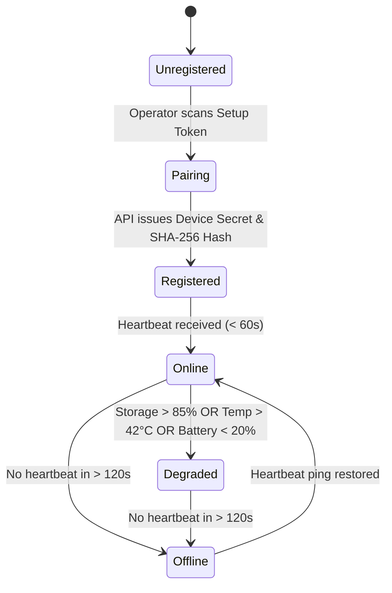

# LUSTER 360 — SYSTEM ARCHITECTURE SPECIFICATION

## 1. Architectural Overview

LUSTER 360 is an enterprise-grade, offline-first 360 photobooth application and distributed cloud management platform engineered for commercial live-event operations. The architecture decouples high-throughput local capture and GPU-accelerated video rendering from asynchronous cloud synchronization, centralized fleet operations, and public media distribution.

```
                                  ┌────────────────────────────────┐
                                  │   OPERATIONS COMMAND CENTER    │
                                  │       (Next.js 14 Web App)     │
                                  └───────────────┬────────────────┘
                                                  │ HTTPS / WSS
                                                  ▼
┌─────────────────────────┐           ┌───────────────────────┐           ┌────────────────────────┐
│    LUSTER 360 BOOTH     │  HTTPS    │   LUSTER MEDIA API    │  gRPC/REST│   GOOGLE DRIVE CLOUD   │
│   (Flutter / Android)   ├──────────►│   (Node.js / Express) ├──────────►│  (V1 Media Storage)    │
│  - Offline Capture Engine│           │  - Storage Resolver   │           │  - Master Videos       │
│  - Local FFmpeg GPU Pipe│◄──────────┤  - Folder Provisioner │◄──────────┤  - Proxy MP4s          │
│  - Resumable Queue      │ Heartbeat │  - Secure Stream Gateway│          │  - High-res Thumbnails │
└─────────────────────────┘           └───────────┬───────────┘           └────────────────────────┘
                                                  │ SQL / RLS
                                                  ▼
                                      ┌───────────────────────┐
                                      │  SUPABASE POSTGRESQL  │
                                      │  - Relational Schema  │
                                      │  - Live Subscriptions │
                                      │  - Device Tokens / RBAC│
                                      └───────────▲───────────┘
                                                  │
                                                  │ Reads / Public Token
                                                  ▼
                                      ┌───────────────────────┐
                                      │ PUBLIC EVENT GALLERY  │
                                      │ (Next.js 14 Dynamic)  │
                                      └───────────────────────┘
```

---

## 2. Core Architectural Pillars

### 2.1 Storage Decoupling & Google Drive V1 Provider
Unlike traditional consumer apps that dump user uploads into monolithic object buckets, Luster 360 implements a strict **Provider-Agnostic Storage Architecture (`MediaStorage`)**:
- **Database (`Supabase PostgreSQL`)**: Houses relational entity metadata, event configurations, telemetry heartbeats, RLS security policies, and short-code routing.
- **Storage Layer (`Google Drive API v3`)**: Serves as the primary media storage engine for finished MP4 renders and poster thumbnails.
- **Luster Media API (Security Gateway)**: Acts as the exclusive broker. **Clients, mobile booths, and public visitors NEVER receive Google Drive API credentials, raw webView links, or service account tokens.**
- **Media Streaming & Downloads**: Media is accessed strictly via `/api/v1/media/stream/:shortCode` and `/api/v1/media/download/:shortCode`, where the backend handles byte-range chunking (`HTTP 206 Partial Content`) and OAuth2 Bearer token injection.

### 2.2 Local-First Offline Resilience
Booth hardware operates in high-density live event environments (ballrooms, convention centers, outdoor wedding tents) where cellular and Wi-Fi connections frequently drop or suffer extreme latency.
- **Unbroken Booth Operation**: Countdown, high-framerate camera capture, FFmpeg speed-ramping, color grading, overlay compositing, and audio mixing execute 100% locally on device hardware.
- **Instant Guest QR Codes**: Even if completely disconnected from the internet, the booth generates immediate QR codes encoding the permanent short URL (`https://gallery.luster360.com/v/XXXXXX`).
- **Resilient Upload Queue**: Completed renders enter an embedded SQLite queue with status `LOCAL_ONLY` -> `QUEUED`. A background daemon uploads with exponential backoff (1s, 2s, 4s, 8s, 16s, 32s, 60s cap) upon network restoration.
- **Status-Aware Guest Interface**: If a guest scans their QR before the video syncs to Google Drive, the gallery displays an animated "Processing Master Render" status page, which automatically transitions to the interactive video player as soon as verification completes.

### 2.3 Server-Independent UTC Duration Calculation
Live photobooth contracts depend on strict billable runtime tracking. Relying on an operating server's uptime or cron ticks produces inaccurate durations when servers restart or connections drop.
- **Authoritative Timestamps**: Every event records explicit `started_at` and `ended_at` ISO 8601 UTC timestamps in PostgreSQL.
- **Dynamic State Engine**:
  - `status = 'draft'`: Duration = 0.
  - `status = 'active'`: Duration = $\text{UTC}_{\text{now}} - \text{started\_at}$.
  - `status = 'paused'`: Duration calculated from accumulated active segments.
  - `status = 'completed'`: Duration = $\text{ended\_at} - \text{started\_at}$.
- Both the Flutter Booth application and the Next.js Command Center calculate identical runtimes directly from these UTC anchors without polling dependencies.

---

## 3. Data Flow & Execution Lifecycles

### 3.1 Video Capture & Processing Flow


### 3.2 Fleet Telemetry & Heartbeat Architecture


Every mobile booth instance emits a lightweight JSON ping every 30 seconds to `/api/v1/devices/heartbeat`:
```json
{
  "device_id": "dev_01HKQXYZ...",
  "battery_level": 94,
  "is_charging": true,
  "storage_free_bytes": 48291048200,
  "storage_total_bytes": 128000000000,
  "thermal_state": "nominal",
  "network_type": "wifi_5ghz",
  "active_event_id": "evt_wedding_001",
  "queue_pending_count": 2,
  "app_version": "1.0.0+1"
}
```
The Command Center displays live status badges (`ONLINE`, `DEGRADED`, `OFFLINE`) derived dynamically from the last heartbeat timestamp without requiring server-side polling cron jobs.

---

## 4. Security & Authorization Architecture

### 4.1 Zero Direct Access Model
- **No Public S3 / GCS / Drive URLs**: Raw storage identifiers and download links are never sent to client browsers or mobile devices.
- **Single-Use Signed Tokens**: Private galleries require password validation before issuing signed session cookies.
- **Short-Code Resolvers**: Cryptographically unguessable 6-to-8 character alphanumeric codes (`nanoid`) map to internal UUIDs in the database layer.

### 4.2 Supabase Row-Level Security (RLS)
PostgreSQL enforces database-level isolation across all 15 tables:
- `admin` role: Unrestricted read/write across all organizations, devices, and events.
- `operator` role: Scoped to events and devices assigned to their operator profile.
- `anon` role: Restricted strictly to reading public gallery headers and media records matching verified `short_code` entries. Direct table queries for device tokens, heartbeat histories, or billing information are rejected at the database engine level.

### 4.3 Hardware Device Authentication
Booth devices authenticate using a mutual token exchange:
1. Operator creates a device in the Command Center, generating a one-time enrollment token.
2. Mobile booth scans the enrollment QR code.
3. Backend issues a cryptographically secure `device_secret`. The backend stores only `sha256(device_secret)`.
4. Mobile booth signs all subsequent API requests using header `X-Luster-Device-Token: <token>`.

---

## 5. Technology Stack Mapping

| Layer | Technology | Primary Function |
|---|---|---|
| **Mobile Booth** | Flutter 3.24+ (Dart) | Cross-platform UI, state management (Riverpod), router |
| **Native iOS** | Swift / AVFoundation | 120/240 FPS Camera capture, hardware lock, brightness lock |
| **Native Android** | Kotlin / Camera2 & NDK | High-speed sensor streaming, thermal throttling mitigation |
| **Video Engine** | FFmpeg (Mobile SDK) | Speed ramping, PNG overlay layer stack, audio muxing |
| **Relational DB** | Supabase PostgreSQL | Schemas, RLS policies, realtime events, triggers |
| **Backend API** | Node.js 20+ / Express 5 | Storage abstraction, Drive V1 adapter, chunked stream proxy |
| **Media Storage** | Google Drive API v3 | Master renders, proxy videos, poster thumbnails |
| **Command Center** | Next.js 14 (App Router) | Fleet monitoring, live duration tracking, event management |
| **Public Gallery** | Next.js 14 (App Router) | Customer-facing video player, instant download, QR sharing |
| **Design System** | Luster Dark Booth Theme | `#86CFFF` Cyan, `#18283F` Dark Navy, `#0B0F17` Black Canvas |
