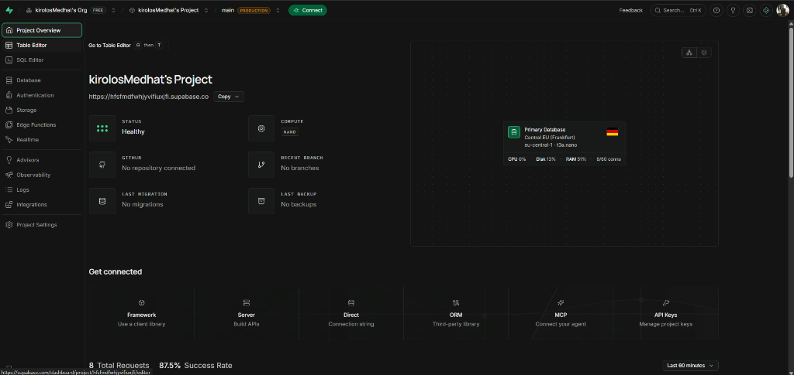
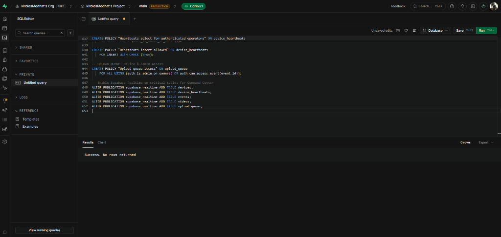
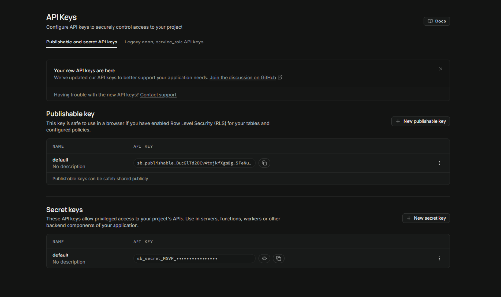
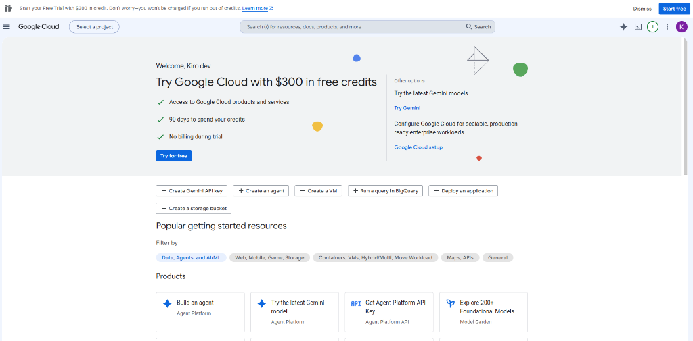
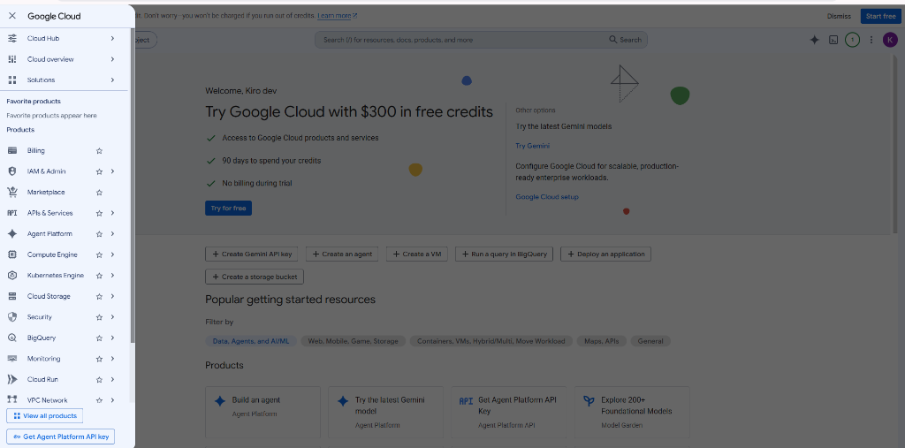
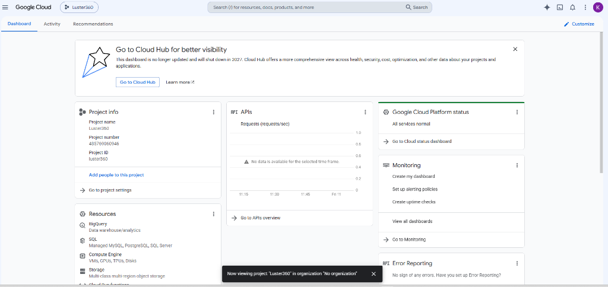
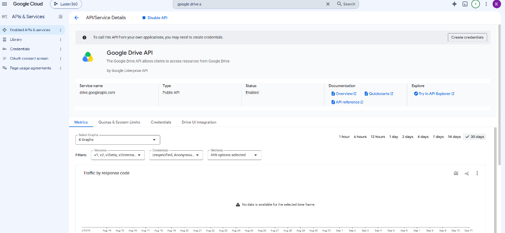

# LUSTER 360 — COMPLETE PLATFORM & OPERATIONS MANUAL
### With Step-by-Step Visual Walkthrough & Production Cloud Credentials

---

## 1. Connected Production Accounts & Cloud Infrastructure

LUSTER 360 is officially configured and connected to your production cloud infrastructure under your verified accounts:

| Cloud Service | Account Email / Identity | Resources & Identifiers |
|---|---|---|
| **Supabase PostgreSQL** | `kirolos.medhat.maksoud@gmail.com`<br>*(Connected via GitHub OAuth)* | **Project Name**: `kirolosMedhat's Project`<br>**Project URL**: `https://hfsfmdfwhjyvifiuxjfi.supabase.co`<br>**Region**: Central EU (Frankfurt) `eu-central-1`<br>**Status**: Healthy (15+ Tables & Realtime live) |
| **Google Drive Cloud** | `kirodev26@gmail.com`<br>*(Google Cloud Owner)* | **Google Cloud Project**: `Luster360` (ID: `luster360`)<br>**Service Account**: `luster-drive-bot@luster360.iam.gserviceaccount.com`<br>**Master Storage Folder**: `LUSTER 360 MASTER STORAGE`<br>**Drive Folder ID**: `1gkYhb-nv1to8TcE9TZqdGmI6J7N02BG6` |
| **LUSTER Media API** | Local / VPS Server | **Port**: `4000`<br>**Storage Engine**: Google Drive V1 Provider |
| **Operations Command Center** | Local / Vercel | **Port**: `3001`<br>**Telemetry**: Live heartbeats & Supabase Realtime |
| **Public Events Gallery** | Local / Vercel | **Port**: `3000`<br>**Routes**: Dynamic `/event/[slug]` & `/v/[shortCode]` |

---

## 2. Visual Setup Walkthrough (Step-by-Step)

All reference screenshots are stored directly in your codebase under [`docs/screenshots/`](file:///e:/SOFTWARE/Luster%20360%20app/docs/screenshots).

### Part A: Supabase Setup Walkthrough

#### Step 1: Project Overview
Your Supabase project was created under `kirolos.medhat.maksoud@gmail.com`.

*Figure 1: Project overview displaying active status in Central EU (Frankfurt) with project URL `https://hfsfmdfwhjyvifiuxjfi.supabase.co`.*

---

#### Step 2: Database Schema & Migration Execution
The relational database was initialized using the SQL Editor:

*Figure 2: Execution of migration `20260910000001_initial_schema.sql` adding tables, RLS policies, and realtime publications.*

---

#### Step 3: API Key Configuration
Publishable and secret keys were retrieved for server and frontend authentication:

*Figure 3: Supabase API keys configured into `backend/.env` and `web/apps/command-center/.env.local`.*

---

### Part B: Google Cloud & Drive Setup Walkthrough

#### Step 4: Google Cloud Console Activation
Accessing Google Cloud under `kirodev26@gmail.com`:

*Figure 4: Google Cloud Console home dashboard.*

---

#### Step 5: Navigation & Product Selection
Opening the primary navigation drawer to access IAM & Services:

*Figure 5: Google Cloud navigation menu showing IAM & Admin and APIs & Services.*

---

#### Step 6: Project Creation (`Luster360`)
The `Luster360` Google Cloud project was created and activated:

*Figure 6: `Luster360` project dashboard.*

---

#### Step 7: Google Drive API Enabled
The Google Drive API was enabled for automated cloud video uploads:

*Figure 7: Google Drive API status verified as Enabled.*

---

#### Step 8: Master Folder Provisioning & Permission Handshake
1. Folder **`LUSTER 360 MASTER STORAGE`** was created in Google Drive under `kirodev26@gmail.com`.
2. Shared with Editor permissions to:
   ```text
   luster-drive-bot@luster360.iam.gserviceaccount.com
   ```
3. Verified Live Folder Hierarchy:
   ```text
   LUSTER 360 MASTER STORAGE (1gkYhb-nv1to8TcE9TZqdGmI6J7N02BG6)
   └── Ahmed & Mariam Wedding (1iKRkihjIT0JKOKDpG5h73gZOPE4yTYCO)
       ├── Videos (1HQ33h0BL9y1_mhIYO3W5a2uBoXpxJFz9)
       ├── Thumbnails (1saLjmL3gMVZ0Nz5WLvA9wwjSTki4nq3F)
       ├── Branding (1C80XB4U7hL1klUcIFu05zgF1BY9ksdV2)
       └── Assets (1HysBrZwwwdIMIBcFap_AvlDExHAoCiNE)
   ```

---

## 3. How to Run the Platform (Step-by-Step)

### Step 1: Start the Backend Media API
Open your terminal in the `backend/` directory:
```bash
cd "e:\SOFTWARE\Luster 360 app\backend"
npm run dev
```
- Listens on `http://localhost:4000`
- Connected to your live Supabase database
- Connected to your Google Drive master storage

---

### Step 2: Start the Operations Command Center
Open a second terminal in the `web/apps/command-center/` directory:
```bash
cd "e:\SOFTWARE\Luster 360 app\web\apps\command-center"
npm run dev
```
- Open your browser at: `http://localhost:3001`
- **Dashboard Features**:
  - Live device telemetry (Battery, Free Storage, Thermal state, Online/Offline status)
  - Active event duration tracker (drift-free UTC calculation)
  - Google Drive storage health monitoring (`/storage`)
  - Event management and booth assignment (`/events`)

---

### Step 3: Start the Public Customer Gallery
Open a third terminal in the `web/apps/events-gallery/` directory:
```bash
cd "e:\SOFTWARE\Luster 360 app\web\apps\events-gallery"
npm run dev
```
- Open your browser at: `http://localhost:3000`
- **Demo Event Gallery**: `http://localhost:3000/event/ahmed-mariam`
- **Single Video Viewer**: `http://localhost:3000/v/8F3K2A`
  *(Features status-aware loading, automatic polling, video playback, and high-speed download)*

---

### Step 4: Run the Mobile Booth App on Device
Open a fourth terminal in the `mobile_app/` directory:
```bash
cd "e:\SOFTWARE\Luster 360 app\mobile_app"
flutter pub get
flutter run
```
- **Phone & External Camera**: 120 FPS high-speed recording
- **Booth Mode**: Immersive full-screen kiosk, 160pt countdown, auto-return timer, operator PIN lock
- **Local FFmpeg Processing**: Renders speed ramp, reverse/boomerang, color grading, overlay stack, and audio mix in ~10 seconds
- **Instant QR Code**: Displays guest sharing QR code immediately even if offline
- **Background Upload Queue**: Syncs master MP4 directly to your Google Drive folder

---

## 4. Live Event Operational Workflow (Photobooth Operator Runbook)

```text
┌───────────────────────────┐
│ 1. Event Setup            │ Operator selects "Ahmed & Mariam Wedding" in Booth App
└─────────────┬─────────────┘
              ▼
┌───────────────────────────┐
│ 2. Booth Mode Activation  │ App enters full-screen kiosk mode with PIN protection
└─────────────┬─────────────┘
              ▼
┌───────────────────────────┐
│ 3. Guest Spin & Capture   │ 160pt countdown (3..2..1..), 120 FPS high-speed recording
└─────────────┬─────────────┘
              ▼
┌───────────────────────────┐
│ 4. Local FFmpeg Render    │ Speed ramp + cinematic grade + PNG overlays + audio (10s)
└─────────────┬─────────────┘
              ▼
┌───────────────────────────┐
│ 5. Instant Guest QR Code  │ Guest scans QR on screen: https://gallery.luster360.com/v/8F3K2A
└─────────────┬─────────────┘
              ▼
┌───────────────────────────┐
│ 6. Background Drive Sync  │ Queue daemon uploads MP4 to Google Drive "Videos" subfolder
└─────────────┬─────────────┘
              ▼
┌───────────────────────────┐
│ 7. Instant Cloud Access   │ Video verifies in Google Drive -> Gallery unlocks play & download
└───────────────────────────┘
```

---

## 5. Security & Maintenance Rules

1. **Credentials Safety**:
   - `backend/service-account.json` is ignored by Git and must **never** be committed to public repositories.
   - `SUPABASE_SERVICE_ROLE_KEY` resides strictly in `backend/.env` and is never bundled in frontend code.
2. **Drive Storage Quota**:
   - Google Drive quota is managed under `kirodev26@gmail.com`.
   - Monitor storage utilization anytime via the Command Center at `http://localhost:3001/storage`.
3. **Offline Resilience**:
   - If venue internet drops, the booth continues to capture and render uninterrupted. All videos remain in the local queue and will upload automatically when connection is restored.
